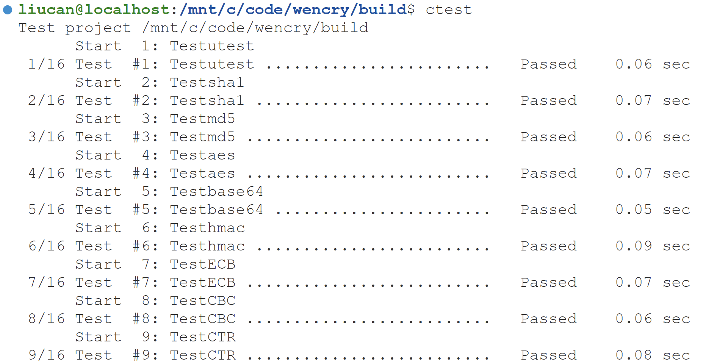
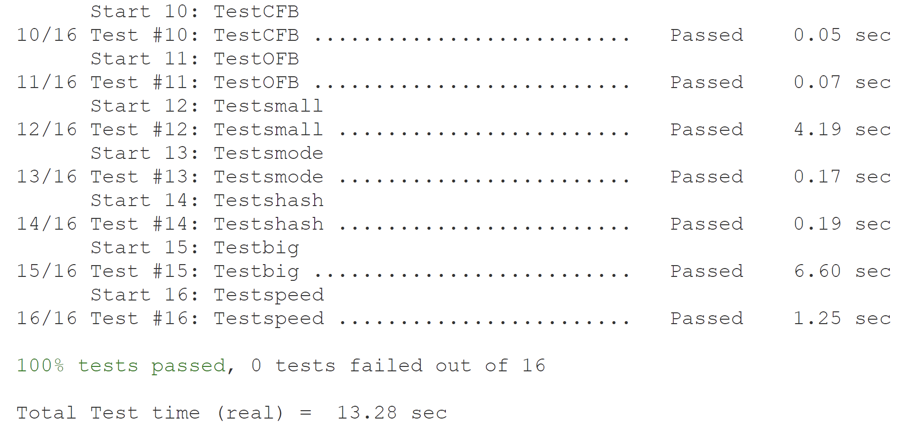
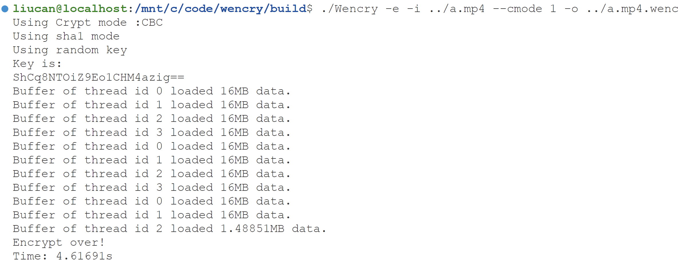
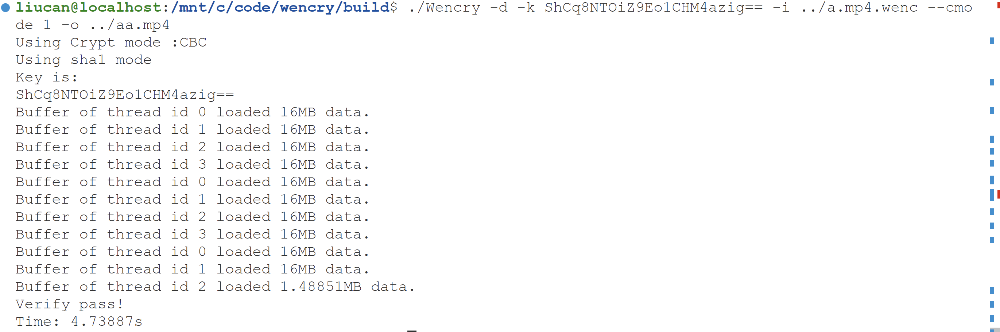

# 面向对象设计方法大作业

姓名:闻嘉迅
学号:211220091
修改日期:2021.5.31

## 引言

在本次大作业中，我选择了第一个选项，即使用设计模式改进代码。  
**原项目介绍**  
原有代码实现了对于文件进行AES加解密及文件验证操作，在加解密时可以进行多线程并发操作。（具体功能参见readme.md）。  
该项目的处理流程包含在`kernel`文件夹中，主要分为两大部分：负责生成哈希的部分以及负责AES加解密的部分。其中哈希部分可支持多种哈希算法并要求具有较高可扩展性，而在AES加密中需要支持ECB,CBC,CTR,CFB,OFB五种加密模式。  

## 项目分析  

经过分析原项目较好地完成了诸如AES、SHA1和MD5等核心算法的实现。而对于加密方式和哈希方式的选择和加密方法/解密方法的判定上存在着可扩展性差的问题。对于多线程并发方面，如何保证文件缓冲区的一致性和访问的原子性是一大挑战。此外，由于加密流程涉及到文件读写、哈希计算、加解密计算和过程打印等多种不同的任务，其设计往往会出现逻辑混乱、难以理解等问题。对于这些问题，需要使用特定的设计模式加以解决。  

- **哈希算法的可扩展问题** 该问题主要存在以下的特点：
    - 多数哈希算法的整体流程趋于一致  
    - 未来可能需要支持更多的哈希算法  
    - 在同一加解密流程中需要不同的哈希算法  
  基于以上几个特点，我们选用模板方法模式来进行优化。
- **AES加密模式的选择问题** 加密器在进行AES加密时，需要选取特定的加密模式进行操作。因此，可以使用策略模式进行优化，使得加密算法的选择更为灵活。  
- **多线程加密时文件缓冲区同步问题** 在加密时，我们需要保证文件缓冲区状态的一致性来保证加密的正确性。因此，可以使用单例模式优化。  
- **生成加密文件流程复杂性问题** 在分析该问题时，我们意识到： 
    - 该流程包含多个子任务
    - 这些子任务的接口十分复杂
    - 子任务间处理流程相互独立
  因此，可以采用外观模式封装子任务，使得代码更加简洁。  

## 优化实现

### 哈希算法的可扩展问题

哈希算法抽象类(kernel/hash/hashmaster.h)：  
```cpp
        class Hashmaster
    {
    u8_t hashblock[64];
    buffer64 *hashbuf;

    protected:
    u32_t totalsize;
    /*
    addtotal:累加总长度
    len:长度
    */
    void addtotal(u32_t len) { totalsize += (len << 3); };

    virtual void getHash(const u8_t *input) = 0;
    virtual void getHash(const u8_t *input, u32_t final_loadsize) = 0;
    virtual void reset() = 0;
    virtual void getres(u8_t *hashout) = 0;

    public:
    static const u8_t gethlen() { return 0; };
    static const u8_t getblen() { return 0; };
    void getFileHash(FILE *fp, u8_t *hashres);
    void getFileOffsetHash(FILE *fp, u8_t *block, u8_t *hashres);
    void getStringHash(const u8_t *string, u32_t length, u8_t *hashres);
    };
```
其中，`getFileHash`等函数为具体产生哈希的函数，作为模板方法。而`getHash`等函数作为基本方法需要被模板方法进行调用。以`getFileHash`为例(实现在kernel/hash/hashmaster.cpp)：  

```cpp
    /*
    getFileHash:返回文件哈希
    fp:文件指针
    hashres:结果哈希地址
    */
    void Hashmaster::getFileHash(FILE *fp, u8_t *hashres)
    {
    reset();
    hashbuf = new buffer64(fp);
    while (true)
    {
        u64_t sum = hashbuf->read_buffer64(hashblock);
        if (sum != 64)
        {
            getHash(hashblock, sum);
            break;
        }
        getHash(hashblock);
    }
    getres(hashres);
    delete hashbuf;
    }
```
在这个模板方法中，首先调用基本方法`reset`进行状态重置，接下来建立文件缓冲区并进入循环。在循环中，首先读取缓冲区中64字节数据并调用基本方法`getHash`进行计算，若读取字节不足64，则退出循环。最后，调用基本方法`getres`获取哈希结果并删除缓冲区。  

随后，我们在同文件夹下的md5.cpp、sha1.cpp中实现了该抽象类的两个算法实例，供上层调用。而新加入的哈希算法仅需要实现四个基本方法，提高了代码复用性。  

### AES加密模式的选择问题
加密算法抽象类(kernel/multiaes/aes/aesmode.h):  
```cpp
    class Aesmode
    {
    protected:
    u8_t iv[16], initiv[16];
    void getXor(u8_t *x, u8_t *mask);

    public:
    Aesmode(const u8_t *iv){
        memcpy(this->initiv, iv, 16);
        memcpy(this->iv, this->initiv, 16);
    };
    /*
    runcry:加解密方法
    block:加密块
    */
    virtual void runcry(u8_t *block) = 0;
    };
```

多线程加密类(kernel/mulitaes/multicry.h):  
```cpp
    class multicry_master
    {
    public:
    const u8_t THREADS_NUM;
    static const u8_t THREAD_MAX = 16;

    private:
    std::thread threads[THREAD_MAX];
    public:
    multicry_master(u8_t thread_num): THREADS_NUM(thread_num){};
    void run_multicry(Aesmode ** mode);
    };
```
在主要方法`run_multicry`中，将会使用多线程的方式对文件进行加密，而其中的参数`mode`则是进行操作的具体算法。该方法将`mode`提供的算法类序列依次传递给每个线程的操作函数`multiruncrypt_file`，进行具体的操作。在该函数中，其会使用`Aesmode`中的`runcry`方法进行加密或解密。  
在实际应用中，`Aesmode`的子类包括了ECB,CBC,CTR,CFB,OFB五种模式的加密和解密算法。因此`run_multicry`加密类的使用仅需提供相应的AES算法，而不用再创建相应的加密或解密类。这种方式简化了加密类的实现，便于加密类更简便地选择需要的算法。  

### 多线程加密时文件缓冲区同步问题

多线程缓冲区类(kernel/multiaes/multi_buffergroup.h):  
```cpp
    /*
    buffergroup:用于多线程的缓冲区组
    buflst:缓冲区数组指针
    size:缓冲区个数
    fileaccess:控制相应序号缓冲区文件读写的互斥锁序列
    */
    class buffergroup
    {
    iobuffer *buflst;
    const u32_t size;
    u32_t turn;
    std::mutex filelock;
    std::condition_variable cond;
    bool over, no_echo;
    buffergroup(u32_t size, bool no_echo);
    ~buffergroup() { delete[] buflst; };

    static buffergroup *instance;
    static std::mutex mtx;

    public:
    buffergroup(const buffergroup &) = delete;
    buffergroup &operator=(const buffergroup &) = delete;

    static buffergroup *get_instance(u32_t size = 4, bool no_echo = false);
    static void del_instance();

    void load_files(FILE *fin, FILE *fout, bool ispadding);
    void printload(const u8_t id, const size_t size);
    u8_t *require_buffer_entry(const u8_t id) { return buflst[id].get_entry(); };
    bool update_lst(const u8_t id);
    bool judge_over(const u8_t id);
    };
```
因为需要保证缓冲区的一致性，因此采用单例模式实现，这里采用了懒汉式实现，可以尽量减少内存占用。  

### 生成加密文件流程复杂性问题

生成加密文件类(kernel/cry.h):  
```cpp
    /*整体加密类*/
    class runcrypt
    {
    pakout_t *pakout;
    const u8_t threads_num;

    // 文件头构造器
    FileHeader header;
    // aes加解密工厂
    AesFactory aesfactory;
    // 并发加解密器
    multicry_master crym;
    // hmac计算器
    hmac hmachandle;
    // 结果打印器
    AbsResultPrint *resultprint;

    void enc(const u8_t *r_buf);
    u8_t verify();
    u8_t dec();
    void over();

    public:
    runcrypt(u8_t *data, u8_t threads_num = THREAD_NUM);
    ~runcrypt()
    {
        delete pakout;
        delete resultprint;
    };
    bool exec_val();
    };
```
采用了外观模式后，加密文件的生成被分为了以下几个子任务。  
- 文件头生成和解析`FileHeader`
- AES算法生成`AesFactory`
- 并发执行AES算法`multicry_master`
- HMAC计算`hmac`
- 结果打印`AbsResultPrint`
以加密模式为例，具体运算流程如下： 
```cpp
    /*
    `enc:将文件加密
    r_buf:随机缓冲数组
    */
    void runcrypt::enc(const u8_t *r_buf)
    {
        // 准备初始向量
        u8_t iv[multicry_master::THREAD_MAX * 20];
        header.getIV(r_buf, iv);
        header.getFileHeader(iv);
        // 准备缓冲区和aes加密器
        buffergroup *iobuffer = buffergroup::get_instance(threads_num, GET_VAL(pakout, no_echo));
        iobuffer->load_files(GET_VAL(pakout, fp), GET_VAL(pakout, out), true);
        Aesmode *mode[threads_num];
        aesfactory.loadiv(iv);
        for (int i = 0; i < threads_num; i++)
            mode[i] = aesfactory.createCryMaster(true, GET_VAL(pakout, ctype));
        // 运行加密
        crym.run_multicry(mode);
        // 写入hamc
        hmachandle.writeFileHmac(pakout->out, pakout->key, FILE_IV_MARK, FILE_HMAC_MARK);
        // 释放空间
        for (int i = 0; i < threads_num; i++)
        {
            buffergroup::del_instance();
            delete mode[i];
        }
    }
```

## 实现功能

本项目实现了多线程文件加解密的功能，测试结果如下： 




本项目支持两种交互模式，无参数模式下可根据提示完成操作，也可以在参数模式下进行文件加解密（详见README.md）。交互模式如下： 


